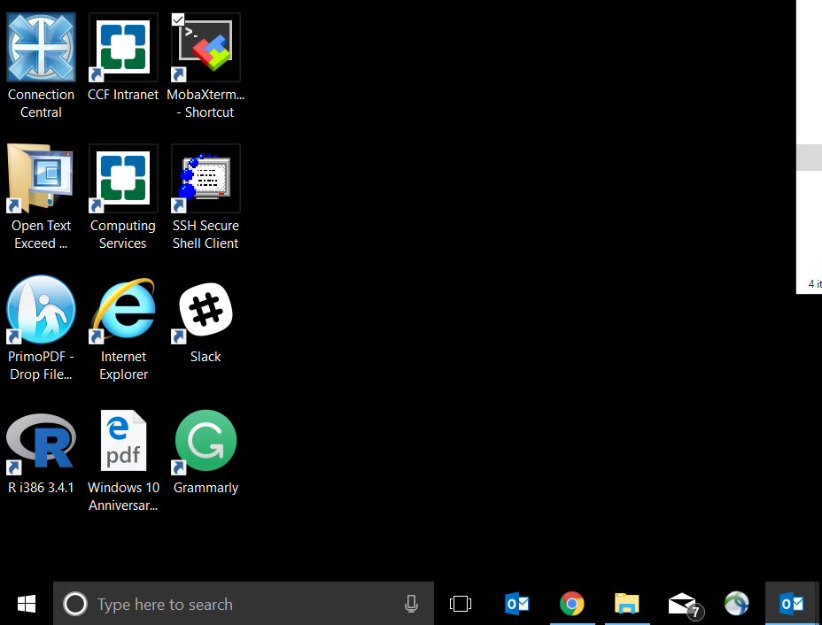
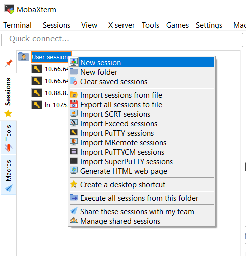

# Setup and Requirements

## SSH client

You will be assigned one of the following IP Addresses:
1. 10.66.64.37
1. 10.66.64.38
1. 10.66.64.39
1. 10.66.64.40

### For Windows Users:
1. Download [MobaXterm](https://download.mobatek.net/1082018070240950/MobaXterm_Portable_v10.8.zip)
1. Extract the zip file to ```C:\users\<user_name>\Downloads```
1. Go to: ```MobaXterm_Portable_v10.8```
1. Create a shortcut to the program file and move it to your Desktop
 * 
1. Launch MobaXterm
1. Go to: ```Session > New session > SSH```
 * 
1. Type the *Linux server IP address* assigned to you and your *username*
1. Make sure that Forwarding X11 is checked in Advanced setting
1. Double clicking the session to connect
1. A prompt appears for password. Simply type your password and hit enter.

### For MacOS Users:
1. Install [XQuartz](https://www.xquartz.org/).
2. Launch XQuartz terminal to connect to a server.
```bash
ssh -Y <username>@<Linux_server_IP_address>
```

## Required programs in Linux
Once in Linux, the following programs should be in the `$PATH` environment variable:
1. fastqc
1. trim_galore
1. cutadapt
1. samtools
1. hisat2
1. picard
1. igv.sh
1. htseq-count
1. R *- With the following libraries:*
 * DESeq2
 * pheatmap
 * gplots
 * ggplot2
 * ggrepel
 * data.table
 * stringr
 * GenomicRanges
 * sleuth
1. PDF viewer
1. python 2.7+
1. perl
1. vim

## Register environment variables
1. Create a working directory: `~/projects`

    ```bash
    cd ~/
    mkdir ~/projects
    cd ~/projects/
    ```

1. Open `~/.bashrc` and add an alias:
    ```bash
    alias l='ls -lt'
    alias binf='cd ~/projects/rnaseq'
    alias rc='cd ~/projects/rnaseq/expression/htseq_counts'
    ```

1. Add the following environment variables to `~/.bash_profile`:
    ```bash
    export PATH=$PATH:$HOME/.local/bin:$HOME/bin #this path must be already setup in ~/.bash_profile; check it out

    export PATH=$PATH:/usr/local/tools/hisat2   
    export RNA_HOME=~/projects/rnaseq
    export RNA_DATA_DIR=$RNA_HOME/data
    export RNA_DATA_TRIM_DIR=$RNA_DATA_DIR/trimmed
    export RNA_REFS_DIR=$RNA_HOME/refs
    export RNA_REF_INDEX=$RNA_REFS_DIR/chr22_with_ERCC92
    export RNA_REF_FASTA=$RNA_REF_INDEX.fa
    export RNA_REF_GTF=$RNA_REF_INDEX.gtf
    export RNA_ALIGN_DIR=$RNA_HOME/alignments/hisat2
    export RNA_TOOLS=$RNA_HOME/tools
    ```

1. Log out and log back in and make sure that the new environment variables are applied!

## Download the workshop material
```bash
cp /mnt/isilon/data/w_QHS/hwangt-share/Datasets/Informatics_workshop/rnaseq/bioinfo_2018July.tar.gz ~/projects/
cd ~/projects
tar zxvf bioinfo_2018July.tar.gz
binf
```

## Generate softlink paths
```bash
binf
cd tools
bash ./setup_tools_path.sh
l ~/bin/ #check that all softlinks are created
```

## Familiarize yourself with
1. tmux
1. copy and paste between Windows and Linux terminal
1. vim text editor

# References
Some contents/material used in this workshop are borrowed from
- https://github.com/griffithlab/rnaseq_tutorial/wiki
- http://bioconductor.org/packages/devel/bioc/vignettes/DESeq2/inst/doc/DESeq2.html#differential-expression-analysis
- http://pedagogix-tagc.univ-mrs.fr/courses/ASG1/practicals/rnaseq_diff_Snf2/rnaseq_diff_Snf2.html
- https://www.youtube.com/watch?v=tlf6wYJrwKY

### Up next
[Preparing RNA-seq analysis](01_prep_rnaseq_analysis.md)
