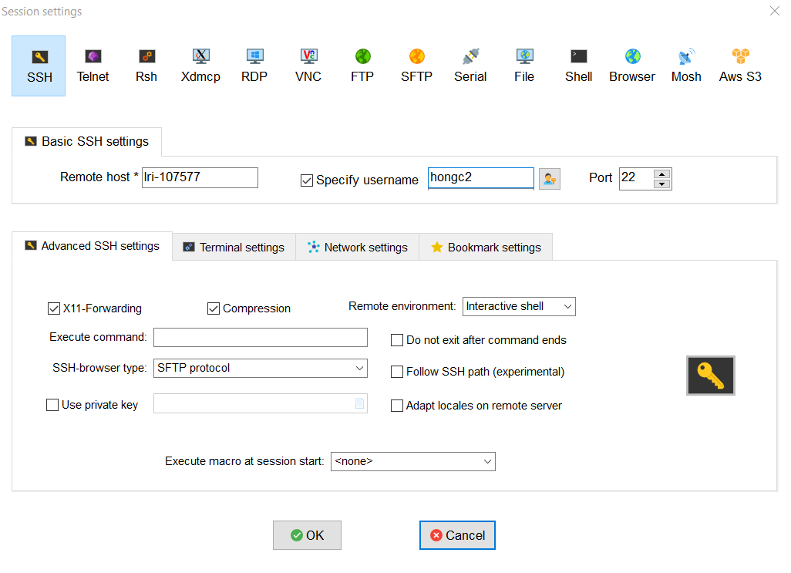

# Setup and Requirements
## Account Information
1. This is our second Bioinformatics workshop, 2018.
1. We will cover basic RNA-seq analyses
1. No prerequisite is required.
1. For those of you registered for this workshop, we already created a Linux account and in advance sent to each of you credential information to access Linux computers at LRI for this workshop (Lerner Research Institute).

## SSH client

1. Download [MobaXterm](https://download.mobatek.net/1082018070240950/MobaXterm_Portable_v10.8.zip)
1. Extract the zip file to "C:\users\<user_name>\Downloads"
1. Go to MobaXterm_Portable_v10.8
1. Copy the program file and paste shortcut into Desktop
1. Launch the MobaXterm
1. Session > New session > SSH
1. Type Linux server IP address assigned to you, user name
1. Make sure that Forwarding X11 is checked in Advanced setting




* HPC host names/ip address
  ```bash
  10.66.64.37
  10.66.64.38
  10.66.64.39
  10.66.64.40
  ```

## Required programs in Linux
The program should be in the path!
1. fastqc
1. trim_galore
1. cutadapt
1. samtools
1. hisat2
1. picard
1. igv.sh
1. htseq-count
1. R (DESeq2,pheatmap,gplots,ggplot2,ggrepel,data.table,stringr,GenomicRanges,sleuth)
1. PDF viewer
1. python 2.7+
1. perl
1. vim

## Register environment variables
1. Create a working directory, `~/projects`
```bash
cd ~/
mkdir -p ~/projects
cd ~/projects/
```
1. Open ~/.bashrc and let us add an alias,

	```bash
	alias l="ls -lt"
	alias binf="cd ~/projects/rnaseq_workshop/rnaseq"
	alias rc="cd ~/projects/rnaseq_workshop/rnaseq/expression/htseq_counts"
	```

1. Also, add the following environment variables in `~/.bash_profile`,
	```bash
	export PATH=$PATH:$HOME/.local/bin:$HOME/bin #this path must be already setup in ~/.bash_profile; check it out
	export PATH=$PATH:/usr/local/tools/hisat2   

	export RNA_HOME=~/projects/rnaseq_workshop/rnaseq
	export RNA_DATA_DIR=$RNA_HOME/data
	export RNA_DATA_TRIM_DIR=$RNA_DATA_DIR/trimmed
	export RNA_REFS_DIR=$RNA_HOME/refs
	export RNA_REF_INDEX=$RNA_REFS_DIR/chr22_with_ERCC92
	export RNA_REF_FASTA=$RNA_REF_INDEX.fa
	export RNA_REF_GTF=$RNA_REF_INDEX.gtf
	export RNA_ALIGN_DIR=$RNA_HOME/alignments/hisat2
	export RNA_TOOLS=$RNA_HOME/tools
	```
	
1. Relogin and make sure that the new environment variables are applied! 

## Download the workshop material
1. `cp /mnt/isilon/data/w_QHS/hwangt-share/Datasets/Informatics_workshop/rnaseq/bioinfo_2018July.tar.gz ~/projects`
1. `cd ~/projects`
1. `tar zxvf bioinfo_2018July.tar.gz`
1. `binf`

## Generate softlink paths
```bash
binf
cd tools
bash ./setup_tools_path.sh
```

## Get familiar with
1. tmux
1. copy and paste between Windows and linux terminal
1. vim text editor

# Reference
Some contents/material used in this workshop are borrowed from
- https://github.com/griffithlab/rnaseq_tutorial/wiki
- http://bioconductor.org/packages/devel/bioc/vignettes/DESeq2/inst/doc/DESeq2.html#differential-expression-analysis
- http://pedagogix-tagc.univ-mrs.fr/courses/ASG1/practicals/rnaseq_diff_Snf2/rnaseq_diff_Snf2.html
- https://www.youtube.com/watch?v=tlf6wYJrwKY