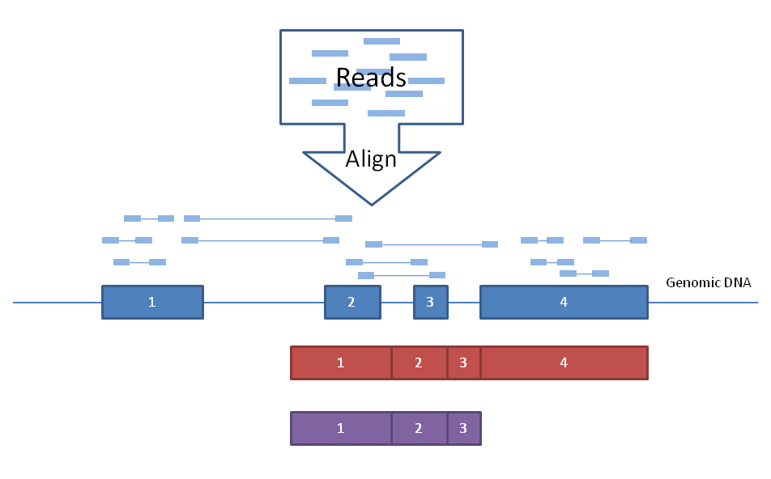

# Preparing RNA-seq analysis
In this section, we will learn the requirements for starting to do data analysis.

## Definitions
- **Reference genome** - The consensus nucleotide sequence of the chromosomes of a species.
- **Genes** - The functional units of a genome.
- **Gene annotations** - Descriptions of gene/transcript models for a genome. They describe the structure of transcripts expressed from those gene loci.
- **Transcript model** - The coordinates of the exons of a transcript on a reference genome. Additional information such as the strand the transcript is generated from, gene name, coding portion of the transcript, alternate transcript start sites, and other information may be provided.
- **GTF (.gtf) file** - A common file format referred to as *Gene Transfer Format* used to store gene and transcript annotation information. You can learn more about this format here: http://genome.ucsc.edu/FAQ/FAQformat#format4

## Reference Genome
Obtain a reference genome from [Ensembl](https://useast.ensembl.org/index.html), [iGenomes](https://support.illumina.com/sequencing/sequencing_software/igenome.html), [NCBI](https://www.ncbi.nlm.nih.gov/refseq/) or [UCSC](http://hgdownload.cse.ucsc.edu/downloads.html) so that we can align RNA-seq reads to the genome sequence. In this example analysis, we will use the human GRCh38 version of the genome from Ensembl. We will perform the analysis using only a single chromosome (chr22) and the ERCC spike-in to make it run faster.

#### Q1.1 Change directory to $RNA_REFS_DIR and check if `chr22_with_ERCC92.fa` is present.

#### Q1.2 List out all sequence headers included in the FASTA file.

 - View 10 lines from approximately the middle of this file.
```bash
head -n 423000 chr22_with_ERCC92.fa | tail
```

#### Q1.3 What is the significance of the upper and lower case characters?

## Annotation

### The purpose of gene annotation (GTF file)
NGS reads (usually from the Illumina sequencing platform) are short and RNA-seq reads are most likely originated from known gene locus. Thus, during the HISAT2 index creation step, the annotations may be provided to create local indexes to represent transcripts as well as a global index for the entire reference genome. This allows for faster and better mapping across exon boundaries and splice sites. If an alignment still cannot be found it will attempt to determine if the read corresponds to a novel exon-exon junction.



### View a preprocessed GTF file

In general, two gene prediction models are available: *RefSeq* and *Ensembl/GENCODE*. RefSeq is more conservative and mostly used in clinical settings whereas Ensembl is more inclusive and widely used in research settings.

In this tutorial, we will use annotations obtained from Ensembl (`Homo_sapiens.GRCh38.86.gtf.gz`) for chromosome 22 only. But, you should get familiar with sources of complete gene annotations for RNA-seq analysis.

Take a look at the contents of the gtf file (`$RNA_REF_GTF`).

```bash
echo $RNA_REF_GTF
less $RNA_REF_GTF
grep start_codon $RNA_REF_GTF | less -S
```
*Press 'q' to exit the 'less' display.*

#### Q1.4 How many unique gene IDs are in the .gtf file?

- We can use a perl command-line command to find out:
```bash
perl -ne 'if ($_ =~ /(gene_id\s\"ENSG\w+\")/){print "$1\n"}' $RNA_REF_GTF | sort | uniq | wc -l
```
 - Using `perl -ne '<code>'` will execute the code between single quotes on the .gtf file, line-by-line.
 - The `$_` variable holds the contents of each line.
 - The `if ($_ =~//)` is a pattern-matching command which will look for the pattern `gene_id` followed by a space followed by `ENSG` and one or more word characters (indicated by `\w+`) surrounded by double quotes.
 - The pattern to be matched is enclosed in parentheses. This allows us to print it out from the special variable `$1`.
 - The output of this perl command will be a long list of ENSG Ids.
 - By piping to `sort`, then `uniq`, and then word count we can count the unique number of genes in the file.

#### Q1.5 List out all transcript IDs included in the GTF file.

### Open GTF file in IGV
IGV will be discussed in the [RNA-seq post-alignment session](05_postalignment-visualization.md). IGV also supports the GTF file format.

Run IGV and load the gtf file:
```bash
igv.sh &
```
1. change genome to hg38
1. `File > Load from file`
1. Select *chr22_with_ERCC92.gtf* and Open
1. Right-Click on the gtf pannel and select `Expanded`
1. Type "*MIOX*" in the search box

## Resources

### Perl regular expression and command line

 - http://perldoc.perl.org/perlre.html#Regular-Expressions
 - http://www.perl.com/pub/2004/08/09/commandline.html

### Annotation files formatted for HISAT2/expression analysis:

There are many possible sources for .gtf gene/transcript annotation files, for example: Ensembl, UCSC, RefSeq, etc. Several options and related instructions for obtaining the gene annotation files are provided below:

#### ENSEMBL FTP SITE
Based on Ensembl annotations only. Available for many species.

http://useast.ensembl.org/info/data/ftp/index.html

#### UCSC TABLE BROWSER
Based on UCSC annotations or several other possible annotation sources collected by UCSC.

You might choose this option if you want to have a lot of flexibility in the annotations you obtain. For example, to grab only the transcripts from chromosome 22 do the following:

1. Open this URL in your browser: http://genome.ucsc.edu/
1. Select `Tools` and then 'Table Browser' at the top of the page.
1. Select `Mammal`, `Human`, and `Dec. 2013 (GRCh38/hg38)` from the first row of drop-down menus.
1. Select `Genes and Gene Predictions` and `GENCODE v24` from the second row of drop-down menus.
1. To limit your selection to only chromosome 22, select the `position` option next to `region`. Enter *chr22* in the `position` box.
1. Select `GTF - gene transfer format` for output format and enter *UCSC_Genes.gtf* for output file.
1. Hit the `get output` button and save the file. Make note of its location.

In addition to the .gtf file, you may find uses for other file formats providing additional and/or alternatively formatted information on the same transcripts. For example, to get a Gene bed file:

1. Change the output format to `BED - browser extensible data`.
1. Change the output file to *UCSC_Genes.bed*, and hit the `get output` button.
1. Make sure `Whole Gene` is selected, hit the `get BED` button, and save the file.

How to get an Exon bed file:

1. Go back one page in your browser and change the output file to `UCSC_Exons.bed`, then hit the `get output` button again.
1. Select `Exons plus`, enter *0* in the adjacent box, hit the `get BED` button, and save the file.

How to get gene symbols and descriptions for all UCSC genes:

- Go back one page in your browser and change `output format` to `selected fields from primary and related tables`.
- Change the output file to *UCSC_Names.txt*, and hit the `get output` button.
- Make sure `chrom` is selected near the top of the page.
- Under `Linked Tables` make sure `kgXref` is selected, and then hit `Allow Selection From Checked Tables`. This will link the table and give you access to its fields.
- Under `hg38.kgXref fields` select: `kgID`, `geneSymbol`, `description`.
- Hit the `get output` button and save the file.

  To get annotations for the whole genome, make sure `genome` is selected next to `region`. By default, the files downloaded above will be compressed. To decompress, use the `gunzip <filename>` command in Linux.

### Up next
[Indexing](02_hisat2_index.md)
