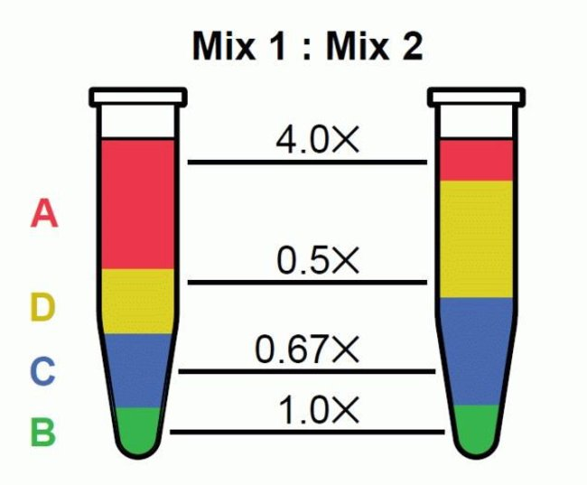

# RNA-seq Data

The test data consists of two commercially available RNA samples: [Universal Human Reference](https://github.com/griffithlab/rnaseq_tutorial/wiki/ResourceFiles/UHR.pdf) (UHR) and [Human Brain Reference](https://github.com/griffithlab/rnaseq_tutorial/wiki/ResourceFiles/HBR.pdf) (HBR). The UHR is total RNA isolated from a diverse set of 10 cancer cell lines. The HBR is total RNA isolated from the brains of 23 Caucasian males and females of varying age, but mostly 60-80 years old. In this workshop, we consider UHR as a **control** group and HBR for an **experimental** group.

## ERCC (within a sample and between samples)
We added an aliquot of the [ERCC ExFold RNA Spike-In Control Mixes](https://github.com/griffithlab/rnaseq_tutorial/wiki/ResourceFiles/ERCC.pdf) to each sample. The spike-in consists of 92 transcripts that are present in well-known, wide-ranged concentrations (from very few copies to many copies). This range allows us to test the degree to which the RNA-seq assay (including all laboratory and analysis steps) accurately reflects the relative abundance of transcript species within a sample.

There are two 'mixes' of these transcripts to allow an assessment of differential expression output between samples. Add one mix in each of your two comparisons. In our case, Mix1 was added to the UHR sample, and Mix2 was added to the HBR sample.



###### Transcript molar ratios in ERCC Spike-In Mixes. Source: https://www.thermofisher.com/order/catalog/product/4456740

## Protocol
We have 3 complete experimental replicates for each sample. This allows us to assess the technical variability of our overall process of producing RNA-seq data in the lab.

All libraries were prepared with the low-throughput protocol from [TruSeq Stranded Total RNA Sample Prep Kit](https://www.illumina.com/products/by-type/sequencing-kits/library-prep-kits/truseq-stranded-total-rna.html) with Ribo-Zero Gold to remove both cytoplasmic and mitochondrial rRNA.

Triplicate, indexed libraries were made in the following manner:

Universal Human Reference (UHR) | Human Brain Reference (HBR)
------------|--------------
100ng Agilent/Stratagene UHR total RNA | 100ng Ambion HBR total RNA
2 μl of 1:1000 ERCC Mix 1 |  2 μl of 1:1000 ERCC Mix 2

1.The libraries were quantified with KAPA Library Quantification qPCR and adjusted to the appropriate concentration for sequencing.
1.The triplicate, indexed libraries were then pooled prior to sequencing.
1.Each pool of three replicate libraries was sequenced across 2 lanes of a HiSeq 2000 using paired-end sequence chemistry with 100bp read lengths.

So to summarize we have:

- UHR + ERCC Spike-In Mix1, Replicate 1
- UHR + ERCC Spike-In Mix1, Replicate 2
- UHR + ERCC Spike-In Mix1, Replicate 3
- HBR + ERCC Spike-In Mix2, Replicate 1
- HBR + ERCC Spike-In Mix2, Replicate 2
- HBR + ERCC Spike-In Mix2, Replicate 3

Each data set has a corresponding pair of FastQ files (read 1 and read 2 of paired-end reads).

The reads are paired-end 101-mers generated on an Illumina HiSeq instrument. The test data has been pre-filtered for reads that appear to map to chromosome 22.

Go to `$RNA_DATA_DIR` and unpack the test data. You should see 6 sets of paired-end FASTQ files. One for each of our sample replicates above. We have 6 pairs (12 files) because in FASTQ format, read 1 and read 2 of each read pair (fragment) are stored in separate files.

```bash
cd $RNA_DATA_DIR
tar -xvf HBR_UHR_ERCC_ds_5pc.tar
l
```

In the data directory, view the first 2 read records of a file (in FASTQ format each read corresponds to 4 lines of data)

```bash
zcat UHR_Rep1_ERCC-Mix1_Build37-ErccTranscripts-chr22.read1.fastq.gz | head -n 8
```

#### Q3.1 Identify the following components of each read: read name, read sequence, and quality string

#### Q3.2 How many reads are there in the first library?
Decompress file on the fly with 'zcat', pipe into 'grep', search for the read name prefix and count a total number of reads.
```bash
zcat UHR_Rep1_ERCC-Mix1_Build37-ErccTranscripts-chr22.read1.fastq.gz | grep -Pc "^\@HWI"
```

## QC check of RNA-Seq reads
#### Q3.3 Run FastQC on your RNA-seq FASTQ files.
First, create an output directory `raw_fastqc` and store report files to the output directory.

#### Q3.4 Open `*_fastqc.html` file in a web browser to view the FastQC report and investigate the source/explanation for over-represented sequences.

## Adapter trimming
Use `trim_galore` to trim sequence adapters from the read FASTQ files. The output of this step will be trimmed FASTQ files for each data set.

Refer to the [trim_galore manual](https://github.com/FelixKrueger/TrimGalore) for a more detailed explanation.

Prepare a subdirectory to store trimmed read files if it doesn't exist:
```bash
mkdir $RNA_DATA_TRIM_DIR
```
Run the following bash shell script (`trim_galore.sh`).

```bash
#!/bin/bash -l

cd $RNA_DATA_DIR # change to RNA-seq read directory

for read_base in `ls *read1.fastq.gz | rev | cut -c 11- | rev | uniq` # list base file names to process
do
    echo "running trim_galore on $read_base ..."
    trim_galore -a AGATCGGAAGAGCGTCGTGTAGGGAAAGAGTGT -a2 AGATCGGAAGAGCACACGTCTGAACTCCAGTCAC --paired --retain_unpaired --gzip --fastqc -o $RNA_DATA_TRIM_DIR ${read_base}1.fastq.gz ${read_base}2.fastq.gz

    echo "renaming qc read_1 ..."
    mv ${RNA_DATA_TRIM_DIR}/${read_base}1_val_1.fq.gz ${RNA_DATA_TRIM_DIR}/${read_base}1.fastq.gz

    echo "renaming qc read_2 ..."
    mv ${RNA_DATA_TRIM_DIR}/${read_base}2_val_2.fq.gz ${RNA_DATA_TRIM_DIR}/${read_base}2.fastq.gz

    echo "Done."
done
```


Options used:
- `-a`, `-a2` - Specified two adapters to trim (if present).
- `--retain_unpaired` - Retain unpaired reads even when one pair becomes too short after trimming.
- `--gzip` - gzip output.
- `--fastqc` - run fastqc on trimmed reads.

** NOTE: `cutadapt` should be in the `$PATH` environment variable.

### Up next
[Alignment](04_alignment.md)
